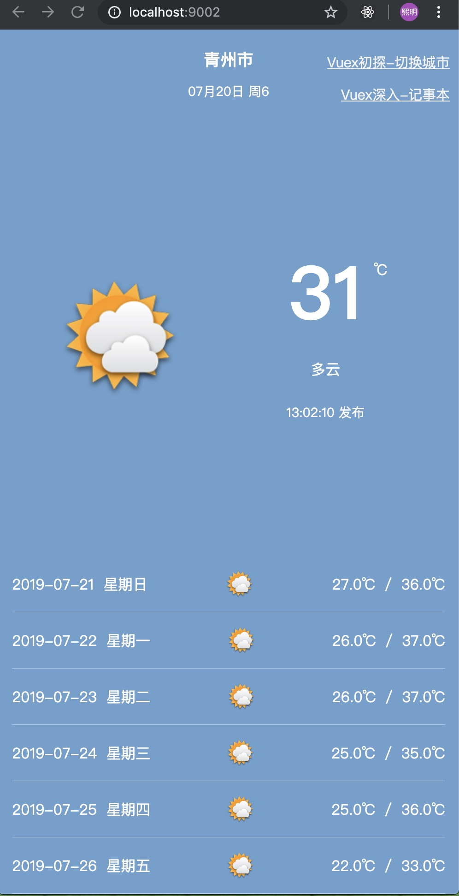
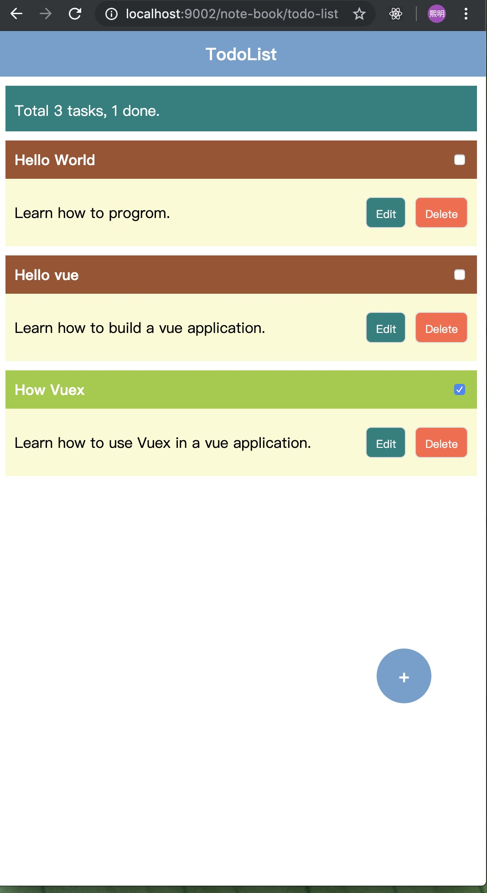
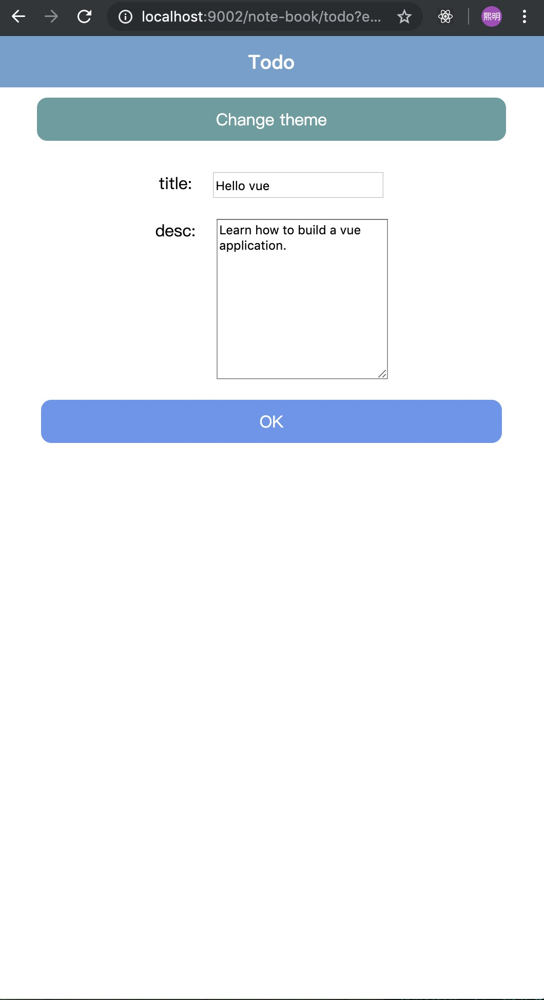
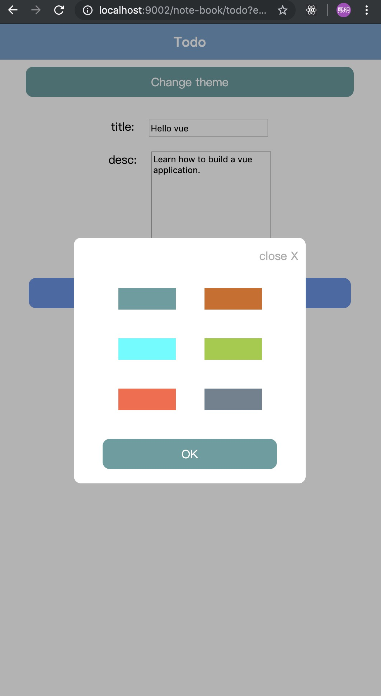

## 青州天气vue版本

<p align="center">
    
    <p align="center">
        <em>天气</em>
    </p>
</p>
<p align="center">
    
    <p align="center">
        <em>记事本1</em>
    </p>
</p>

<p align="center">
    
    <p align="center">
        <em>记事本2</em>
    </p>
</p>

<p align="center">
    
    <p align="center">
        <em>选择主题</em>
    </p>
</p>

### 说明
* vue学习整理
* 未严格按照Vue[风格指南](https://cn.vuejs.org/v2/style-guide/)
* 旨在学习与交流vue语法以及基本入门
* 由于对css了解不深入，使用了flex-box布局，界面样式可忽略

### 功能
* 基于nuxt搭建项目
* axios数据请求以及跨域问题解决方案
* router（页面跳转动画等）
* vuex基本用法封装与实现,全局store，修改主题等（暂未实现语言全球化）。
* vuex深入，模块下store（module），经典的记事本(任务管理)demo
* 基本组件封装
* 组件传值（props）
* 子父组件互调用
* 封装模态框以及slot的使用
* eslint配置（暂未配置）

### 参考文档
* [vue](https://cn.vuejs.org/v2/guide/)
* [nuxt](https://zh.nuxtjs.org/guide)

### 依赖库
* [vue](https://cn.vuejs.org/v2/guide/)
* vue服务端渲染：[nuxt](https://zh.nuxtjs.org/guide)
* Node.js服务器端呈现：[vue-server-renderer](https://github.com/vuejs/vue/tree/dev/packages/vue-server-renderer#readme)
* vue路由管理器：[vue-router](https://github.com/vuejs/vue-router#readme)
* Vue Loader 是一个 webpack 的 loader，它允许你以一种名为单文件组件 (SFCs)的格式撰写 Vue 组件: [vue-loader](https://github.com/vuejs/vue-loader),[中文文档](https://vue-loader.vuejs.org/zh/)
* Webpack的Vue样式加载程序模块:[vue-style-loader](https://github.com/vuejs/vue-style-loader#readme)
* 日期处理类库：[moment](http://momentjs.cn/)

### 运行项目

* clone项目或者直接下载压缩包

```
git clone https://github.com/weifengzz/qz-weather-vue.git

```

* 安装依赖

```
    npm install
```

or

```
    yarn
```

* 运行 

```
    npm run dev
```

* 打开网页，输入网址

```
    http://localhost:9002/
```

### axios跨域问题
* 添加 @nuxtjs/axios，@nuxtjs/proxy 依赖库
```
    npm install @nuxtjs/axios @nuxtjs/proxy --dev

```
* 在nuxt.config.js文件中配置

```
    modules: [
      '@nuxtjs/axios',
      '@nuxtjs/proxy'
    ],
    axios: {
      proxy: true
    },
    proxy: {
      '/api': {
        target: 'http://t.weather.sojson.com/api/weather/city/',
        pathRewrite: {
          '^/api' : '/'
        }
      }
    }
```

* [详情请参考](https://zh.nuxtjs.org/faq/http-proxy/)

### 计算属性 computed
* [计算属性文档](https://cn.vuejs.org/v2/guide/computed.html)

* 例1(无参数)：

```
...
<p class="q-release-time-text">{{ releaseTime }} 发布</p>
....

export default {
  ...
  computed: {
    // 使用计算属性，获取发布时间
    releaseTime: () => {
      return moment().format('hh:mm:ss')
    }
  }
  ...
}

```

* 例2（有参数）

```
...
<p class="q-release-time-text">{{ releaseTime('hh:mm:ss') }} 发布</p>

....

export default {
  ...
  computed: {
    // 使用计算属性，获取发布时间
    releaseTime: () => {
      return  (format) => {
        return moment().format(format)
      }
    }
  }
  ...
}
```

### vue组件 : 符号的作用

* :是v-bind的缩写，是为了动态绑定数据。

```
  <!-- 完整语法 -->
  <a v-bind:href="url">...</a>

  <!-- 缩写 -->
  <a :href="url">...</a>

```

### vue中 @ 符号的作用
* @是v-on的缩写。

```
<!-- 完整语法 -->
<a v-on:click="doSomething">...</a>

<!-- 缩写 -->
<a @click="doSomething">...</a>
```

### 动态设置样式

* 动态绑定class写法 :

```
<div :class="{'bor':clicked==index}"></div>
```

* 动态绑定style

```
  <div :style="{ 'background-color': theme.color }">
```


### vuex的使用

* 说明：vuex封装的比较好相对于redux简单
* 参考资料：[5分钟带你入门vuex（vue状态管理）](https://baijiahao.baidu.com/s?id=1618794879569468435&wfr=spider&for=pc)
* 官方参考资料: [vuex](https://vuex.vuejs.org/zh/installation.html)
* 如果想深入了解，请参考：[redux基本原理](https://www.redux.org.cn/)
